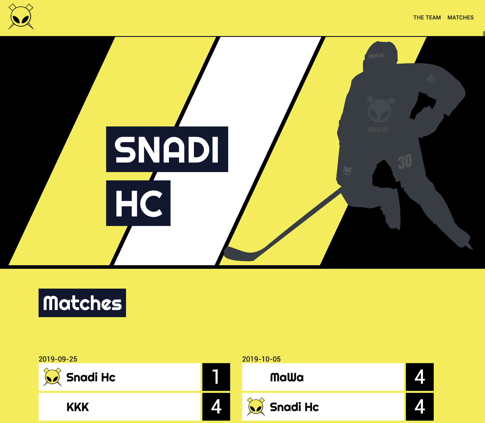

# ManCity React App

The main purpose of building this app was to get advanced in React, components, classes, states, props, routes, animations, importing 3rd party packages and also to learn how to retrive data, authentication through Firebase.

ManCity App has two main sections, public and admin. Only authenticated users can reach admin dashboard and from there, it is possible to add/edit matches and players. You can see team players and match results from public site.

# Demo
Click the link below to see the app.  
[firebase](https://man-city-8faac.web.app/)

# Preview

# Author

Koray Dündar
